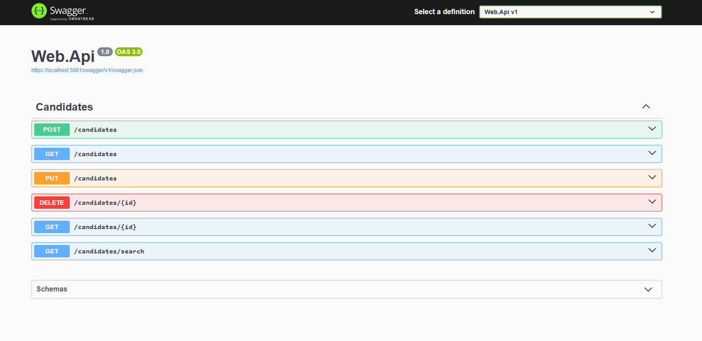

## 🚀 Getting Started

Follow the steps below to set up the project on your local machine:

### Clone the Repository:
```bash
git clone https://github.com/akhadov/job-candidate-hub.git
```

### Install Dependencies:
- [Download and install the latest .NET 9.0 SDK](https://dotnet.microsoft.com/download/dotnet/9.0) (latest version)
- [Download and install Docker Desktop](https://www.docker.com/products/docker-desktop) (required for containerized services)

### Launch the App:
```bash
cd job-candidate-hub
docker compose up
```

Alternatively, open the solution in **Visual Studio**, set **Docker-Compose** as the startup project, and run the application.

> ⚠ **Warning:** If the application fails to run, shut it down and restart it to resolve potential issues.

### API Documentation:
Once the application is up and running, you can explore its API endpoints using Swagger UI at the following links:
- **Secure Endpoint:** [https://localhost:5001/swagger/index.html](https://localhost:5001/swagger/index.html)
- **Non-Secure Endpoint:** [http://localhost:5000/swagger/index.html](http://localhost:5000/swagger/index.html)

### Swagger UI Preview:


### Sample Create Endpoint Request:
To create a new candidate, use the following JSON payload:

```json
{
  "firstName": "John",
  "lastName": "Doe",
  "phoneNumber": "123-456-7890",
  "email": "john.doe@example.com",
  "preferredCallStart": "09:00",
  "preferredCallEnd": "10:00",
  "linkedIn": "https://www.linkedin.com/in/johndoe",
  "gitHub": "https://github.com/johndoe",
  "notes": "Experienced software developer."
}
```

### Logging and Analysis:
- **Seq for searching and analyzing structured logs**
  - Seq is available at [http://localhost:8081](http://localhost:8081) by default.

### Development Time:
- **Total time spent developing this application is 5 hours**
